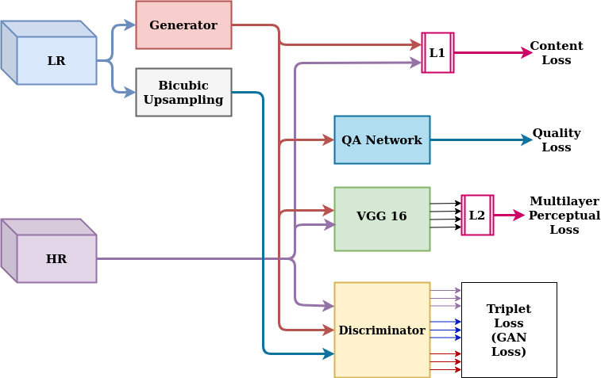
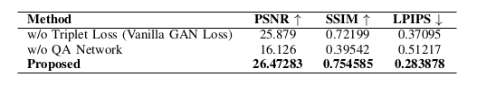
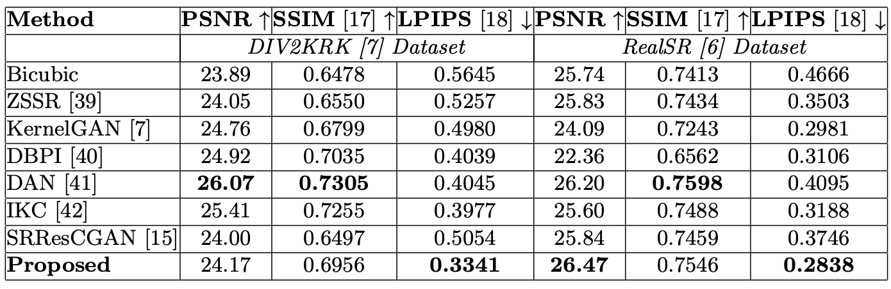
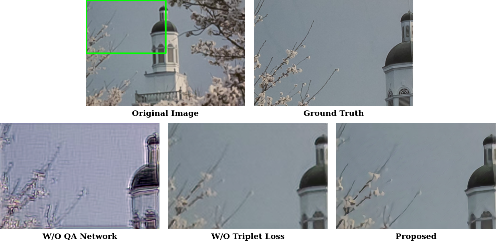

# Code Framework
The overall code framework is shown in the following figure. It mainly consists of four parts - `Config`, `Data`, `Model` and `Network`.

   

Let us take the train commad `python train.py -opt options/train/train_srtgan.json` for example. A sequence of actions will be done after this command. 

- [`train.py`](https://github.com/Dhruv2012/Image-SuperResolution/blob/master/train.py) is called. 
- Reads the configuration (a json file) in [`options/train/train_srtgan.json`](https://github.com/Dhruv2012/Image-SuperResolution/blob/master/options/train/train_srtgan.json), including the configurations for data loader, network, loss, training strategies and etc. The json file is processed by [`options/options.py`](https://github.com/Dhruv2012/Image-SuperResolution/blob/master/options/train/train_srtgan.json).
- Creates the train and validation data loader. The data loader is constructed in [`data/__init__.py`](https://github.com/Dhruv2012/Image-SuperResolution/blob/master/data/__init__.py) according to different data modes.
- Creates the model (is constructed in [`models/__init__.py`](https://github.com/Dhruv2012/Image-SuperResolution/blob/master/models/__init__.py) according to different model types). A model mainly consists of two parts - [network structure] and [model definition, e.g., loss definition, optimization and etc]. The network is constructed in [`models/network.py`](https://github.com/Dhruv2012/Image-SuperResolution/blob/master/models/networks.py) and the detailed structures are in [`models/modules`](https://github.com/Dhruv2012/Image-SuperResolution/blob/master/models/modules).
- Start to train the model. Other actions like logging, saving intermediate models, validation, updating learning rate and etc are also done during the training.  

Moreover, there are utils and userful scripts. A detailed description is provided as follows.

<!-- ## Table of Contents
1. [Config](#config)
1. [Data](#data)
1. [Model](#model)
1. [Network](#network)
1. [Utils](#utils)
1. [Scripts](#scripts) -->

## Config
#### [`options/`](https://github.com/Dhruv2012/Image-SuperResolution/blob/master/options) Configure the options for data loader, network structure, model, training strategies and etc.

- `json` file is used to configure options and [`options/options.py`](https://github.com/Dhruv2012/Image-SuperResolution/blob/master/options/options.py) will convert the json file to python dict.
- `json` file uses `null` for `None`; and supports `//` comments, i.e., in each line, contents after the `//` will be ignored. 
- Supports `debug` mode, i.e, model name start with `debug_` will trigger the debug mode.
- The configuration file and descriptions can be found in [`options`](https://github.com/Dhruv2012/Image-SuperResolution/blob/master/options).

## Data
#### [`data/`](https://github.com/Dhruv2012/Image-SuperResolution/blob/master/data) A data loader to provide data for training, validation and testing.

- A separate data loader module. You can modify/create data loader to meet your own needs.
- Uses `cv2` package to do image processing, which provides rich operations.
- [`data/util.py`](https://github.com/Dhruv2012/Image-SuperResolution/blob/master/data/util.py) provides useful tools. 
- Now, we convert the images to format NCHW, [0,1], RGB, torch float tensor.

## Model
#### [`models/`](https://github.com/Dhruv2012/Image-SuperResolution/blob/master/models) Construct different models for training and testing.

- A model mainly consists of two parts - [network structure] and [model defination, e.g., loss definition, optimization and etc]. The network description is in the [Network part](#network).
- Based on the [`base_model.py`](https://github.com/Dhruv2012/Image-SuperResolution/blob/master/models/base_model.py), we define different models, e.g., [`SR_model.py`](https://github.com/Dhruv2012/Image-SuperResolution/blob/master/models/SR_model.py), [`SRGAN_model.py`](https://github.com/Dhruv2012/Image-SuperResolution/blob/master/models/SRGAN_model.py), [`SRRaGAN_model.py`](https://github.com/Dhruv2012/Image-SuperResolution/blob/master/models/SRRaGAN_model.py) and [`SFTGAN_ACD_model.py`](https://github.com/Dhruv2012/Image-SuperResolution/blob/master/models/SFTGAN_ACD_model.py).

## Network
#### [`models/modules/`](https://github.com/Dhruv2012/Image-SuperResolution/blob/master/models/modules) Construct different network architectures.

- The network is constructed in [`models/network.py`](https://github.com/Dhruv2012/Image-SuperResolution/blob/master/models/networks.py) and the detailed structures are in [`models/modules`](https://github.com/xinntao/BasicSR/tree/master/codes/models/modules).
- We provide some useful blocks in [`block.py`](https://github.com/Dhruv2012/Image-SuperResolution/blob/master/models/modules/block.py) and it is flexible to construct your network structures with these pre-defined blocks.
- You can also easily write your own network architecture in a seperate file like [`sft_arch.py`](https://github.com/Dhruv2012/Image-SuperResolution/blob/master/models/modules/sft_arch.py). 

## Utils
#### [`utils/`](https://github.com/Dhruv2012/Image-SuperResolution/blob/master/utils) Provide useful utilities.

- [logger.py](https://github.com/Dhruv2012/Image-SuperResolution/blob/master/utils/logger.py) provides logging service during training and testing.
- Support to use [tensorboard](https://www.tensorflow.org/programmers_guide/summaries_and_tensorboard) to visualize and compare training loss, validation PSNR and etc. Installationand usage can be found [here](https://github.com/Dhruv2012/Image-SuperResolution/blob/master/utils).
- [progress_bar.py](https://github.com/Dhruv2012/Image-SuperResolution/blob/master/utils/progress_bar.py) provides a progress bar which can print the progress. 

## Scripts
#### [`scripts/`](https://github.com/Dhruv2012/Image-SuperResolution/blob/master/scripts) Privide useful scripts.
Details can be found [here](https://github.com/Dhruv2012/Image-SuperResolution/blob/master/scripts).

# Architecture
The proposed Supervised method expects the LR and its corresponding HR image as the input. The details of the proposed architecture are shown in the figure below.

   

Image Super-resolution on LR image is performed using `Genertor Network`, which is trained using a composite loss consisting of `content loss`, `perceptual loss`, `adversarial loss`, and `quality
assessment loss`.

# Table of Results
The quantitative assessment of the proposed method without QA and without discriminator networks carried out on RealSR validation dataset.

   

The quantitative comparison of the proposed and other existing SR methods on Real SR validation and DIV2KRK datasets.

   

# Output 
The comparison of the Super-Resolution results obtained using the Proposed Architecture and Without Quality Loss method and Without Triplet Loss (Vanilla GAN Loss) method on NTIRE-2020 Real world SR  challenge testing dataset.

   

